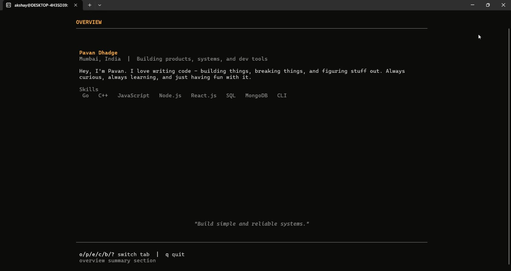
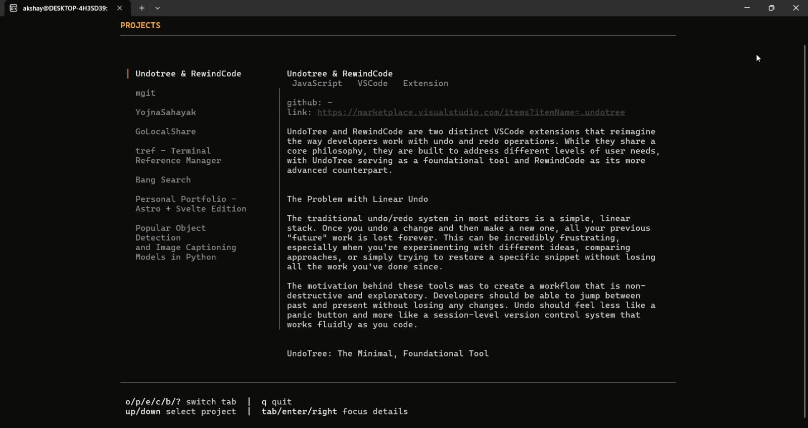
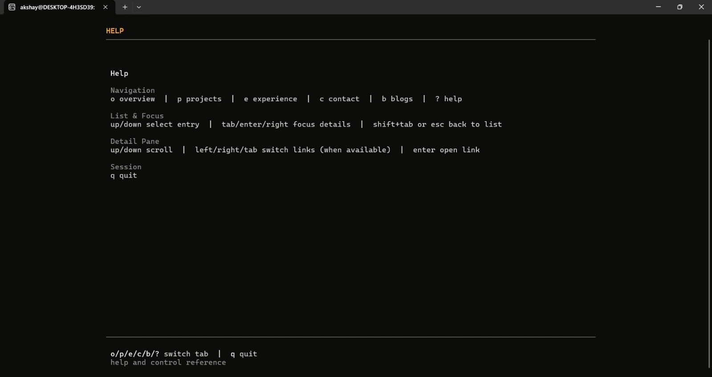

# SSH Portfolio

This is my SSH portfolio but I decided to open-source it. You can read the blog on my website and enjoy!

Terminal portfolio served over SSH using Go, Wish, and Bubble Tea.

## Quick Start

```bash
go run ./cmd/ssh_portfolio
```

By default it listens on `127.0.0.1:2222`.

Connect from another terminal:

```bash
ssh 127.0.0.1 -p 2222
```

## Configuration

Environment variables:

- `SSH_PORTFOLIO_HOST` (default: `127.0.0.1`)
- `SSH_PORTFOLIO_PORT` (default: `2222`)
- `SSH_PORTFOLIO_HOST_KEY` (default: `.wish/ssh_portfolio_ed25519`)
- `DEBUG` (set any value to write Bubble Tea logs to `debug.log`)

Example:

```bash
SSH_PORTFOLIO_HOST=0.0.0.0 SSH_PORTFOLIO_PORT=2222 go run ./cmd/ssh_portfolio
```

## Screenshots






## Optimized Build (Small + Fast)

### Portable optimized binary

```bash
CGO_ENABLED=0 go build -trimpath -ldflags="-s -w -buildid=" -o build/ssh_portfolio ./cmd/ssh_portfolio
```

### Aggressive size optimization (UPX)

```bash
CGO_ENABLED=0 GOOS=linux GOARCH=amd64 GOAMD64=v3 \
go build -trimpath -ldflags="-s -w -buildid=" -o build/ssh_portfolio ./cmd/ssh_portfolio && \
upx --best --lzma build/ssh_portfolio
```

Note: UPX reduces size further but may slightly affect startup time.

## Tests

```bash
go test ./...
```
